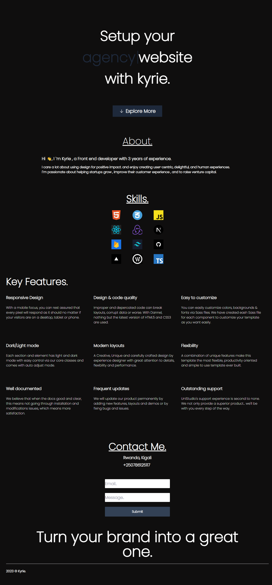

# 🌟 Personal Portfolio Project

Welcome to my personal portfolio project! 🎉

🔗 **Live Site**: [Visit My Portfolio](https://portfolio-kappa-six-71.vercel.app/)


This is a [Next.js](https://nextjs.org/) project bootstrapped with [`create-next-app`](https://github.com/vercel/next.js/tree/canary/packages/create-next-app).

## 🚀 Getting Started

First, run the development server:

```bash
npm run dev
# or
yarn dev
# or
pnpm dev
```

Open [http://localhost:3000](http://localhost:3000) with your browser to see the result.

You can start editing the page by modifying `app/page.js`. The page auto-updates as you edit the file.

### 🔧 API Routes

[API routes](https://nextjs.org/docs/api-routes/introduction) can be accessed on [http://localhost:3000/api/hello](http://localhost:3000/api/hello). This endpoint can be edited in `pages/api/hello.js`.

The `pages/api` directory is mapped to `/api/*`. Files in this directory are treated as [API routes](https://nextjs.org/docs/api-routes/introduction) instead of React pages.

### 🖋 Font Optimization

This project uses [`next/font`](https://nextjs.org/docs/basic-features/font-optimization) to automatically optimize and load Inter, a custom Google Font.

## 📚 Learn More

To learn more about Next.js, take a look at the following resources:

- 📖 [Next.js Documentation](https://nextjs.org/docs) - Learn about Next.js features and API.
- 🧑‍🏫 [Learn Next.js](https://nextjs.org/learn) - An interactive Next.js tutorial.

You can check out [the Next.js GitHub repository](https://github.com/vercel/next.js/) - your feedback and contributions are welcome!

## 🚀 Deploy on Vercel

The easiest way to deploy your Next.js app is to use the [Vercel Platform](https://vercel.com/new?utm_medium=default-template&filter=next.js&utm_source=create-next-app&utm_campaign=create-next-app-readme) from the creators of Next.js.

Check out our [Next.js deployment documentation](https://nextjs.org/docs/deployment) for more details.

---

Feel free to reach out if you have any questions or feedback. Happy coding! 💻🚀

---

This project is open source and available under the [MIT License](LICENSE).

---

👤 **Author**: [Your Name](https://your-portfolio-link)

🌍 **Follow Me**:
- [LinkedIn](https://www.linkedin.com/in/yourprofile/)
- [Twitter](https://twitter.com/yourprofile)
- [GitHub](https://github.com/yourprofile)

Enjoy exploring my portfolio! 🌟